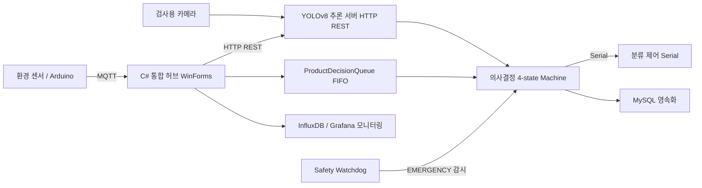

# 제조 데이터 관리 및 전송 시스템 (Manufacturing Data Hub)
> 환경 텔레메트리·실시간 제어·AI 추론·영속화를 단일 C# 허브로 통합한 제조 검사 라인 데이터 관리 시스템

## 📌 프로젝트 정보
| 항목 | 내용 |
|------|------|
| 개발 기간 | 2026.04.22 ~ 2026.05.04 |
| 팀 구성 | 5인 팀 프로젝트 |
| 담당 역할 | 부팀장 · Application Engineer (PC 통합 허브 및 의사결정 엔진) |
| 시연 영상 | 준비 중 |

## 🎯 프로젝트 개요
제조 검사 라인에서 발생하는 환경 텔레메트리, 실시간 제어 신호, AI 비전 추론 결과, 영속화 데이터를 단일 C# WinForms 허브로 통합한 제조 데이터 관리 시스템입니다. 데이터 특성에 따라 통신 프로토콜을 분리하고, 상태머신 기반 제어 흐름과 이중화 세이프티 감시를 적용해 라인의 안정성을 확보했습니다. 또한 ALCOA 원칙을 반영한 감사 로그와 관측성 엔드포인트를 통해 데이터 무결성과 모니터링을 동시에 충족하도록 설계했습니다.

## ✨ 주요 기능 / 담당 업무
- **4채널 통신 허브 설계**: MQTT(환경 텔레메트리), USB Serial(실시간 제어), HTTP REST(YOLO 추론), MySQL(영속화)을 단일 C# WinForms 앱에 통합하고, 데이터 특성별로 프로토콜을 분리하는 원칙을 적용했습니다.
- **ProductDecisionQueue + 4-state Machine**: 검사 지점(S1)과 분류 지점(S2~S4)의 시간차를 thread-safe FIFO 큐로 해결하고, IDLE / RUNNING / PAUSED / EMERGENCY 상태 전이 로직을 설계했습니다.
- **Safety Monitor 이중화 watchdog**: MQTT broker 5초 단절과 Arduino heartbeat 1초 단절을 독립적으로 감시하고, 환경 임계값 초과 시 EMERGENCY 상태로 자동 전이하도록 구현했습니다.
- **ALCOA 감사 로그 + 관측성**: event_log에 SHA-256 hash chain을 적용해 로그 무결성을 보장하고, /metrics 엔드포인트를 노출하여 Grafana 모니터링과 연계했습니다.

## 🛠 기술 스택
### Software
- C# .NET (WinForms, MQTTnet, OpenCvSharp)
- Python (Flask, Ultralytics YOLOv8, paho-mqtt)
- Arduino C++
- Mosquitto MQTT
- MySQL 8.0
- InfluxDB / Telegraf / Grafana
- Docker Compose
- Roboflow

### Hardware
- Raspberry Pi 5
- Arduino
- 검사용 카메라

## 🔀 시스템 아키텍처

센서와 Arduino의 데이터는 MQTT/Serial로 C# 허브에 수집되고, 카메라 영상은 YOLO 추론을 거쳐 4-state 의사결정 엔진으로 전달되며, 결과는 분류 제어·MySQL 영속화·Grafana 모니터링으로 분기되고 Safety Watchdog가 EMERGENCY 전이를 감시합니다.

## 📸 스크린샷
> `images/` 폴더에 이미지를 추가한 뒤 아래 경로를 맞춰주세요.

| 화면 | 설명 |
|------|------|
|  | C# 통합 허브 메인 대시보드 |
|  | Grafana 환경 텔레메트리 모니터링 |

## 🎬 시연 영상

