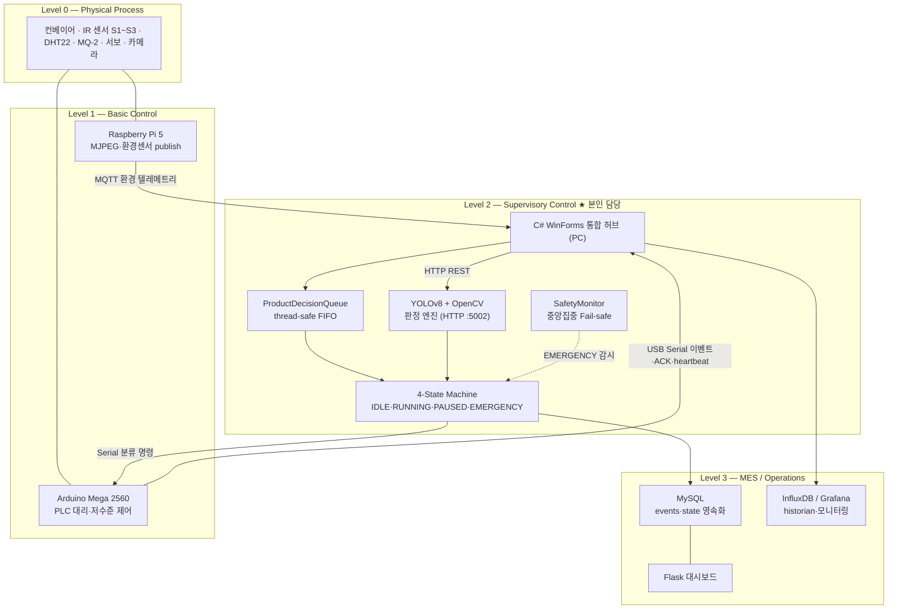
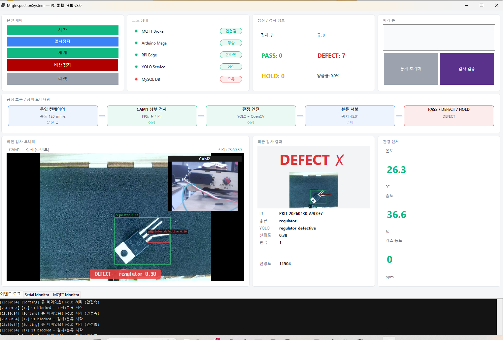
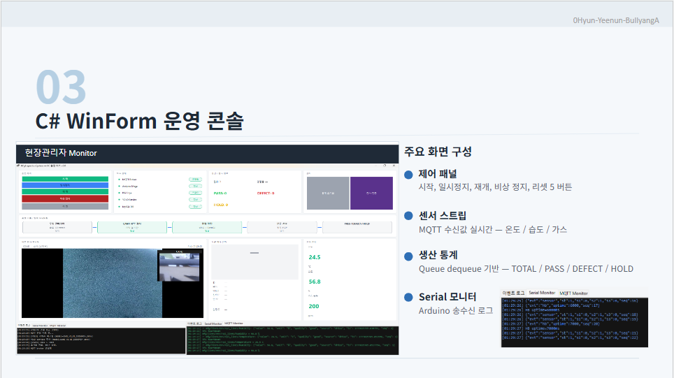
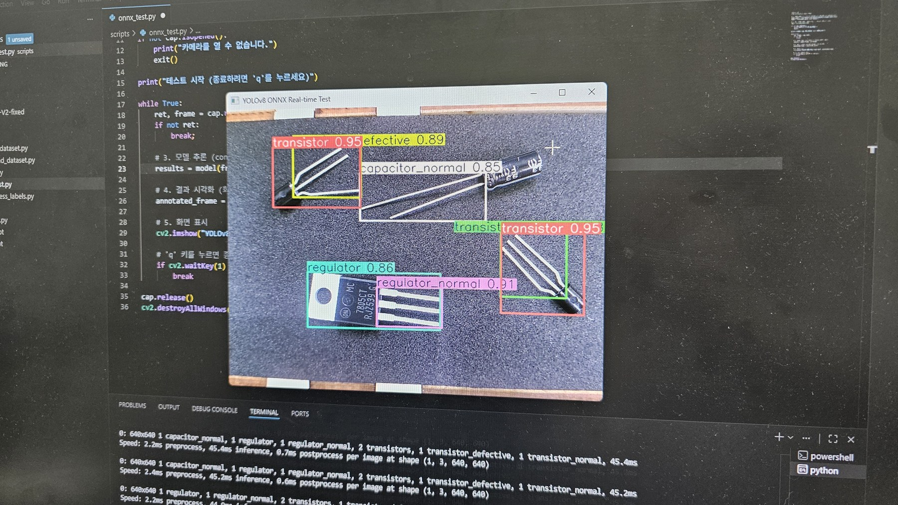
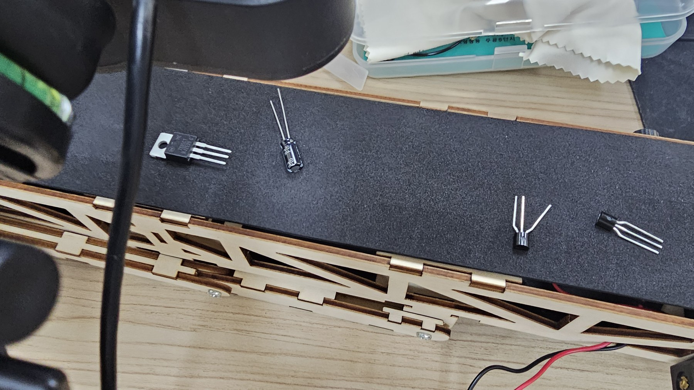
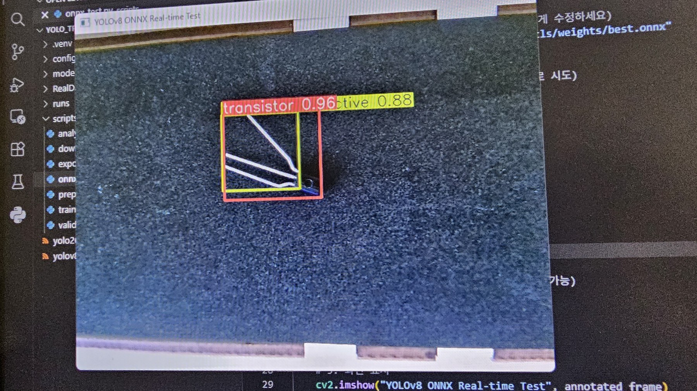

# 제조 데이터 관리 및 전송 시스템 (Manufacturing Data Hub)
> 환경 텔레메트리·실시간 제어·AI 추론·영속화를 단일 C# 허브로 통합한 제조 검사 라인 데이터 관리 시스템 (ISA-95 Purdue Model 4계층)


## 📌 프로젝트 정보
| 항목 | 내용 |
|------|------|
| 개발 기간 | 2026.04.22 ~ 2026.05.03 |
| 팀 구성 | 5인 팀 프로젝트 (Data-Mogi) |
| 담당 역할 | 부팀장 · Application Engineer (PC 통합 허브 · 의사결정 엔진) |
| 담당 스택 | C# .NET 8 WinForms, MQTTnet 4, OpenCvSharp4, System.IO.Ports, HttpClient, MySqlConnector, Serilog, prometheus-net |
| 시연 영상 | [YouTube](https://youtu.be/KO_Lyd2x24o) |

## 🎯 프로젝트 개요
컨베이어 벨트 위 전자 부품(트랜지스터 / 커패시터 / 레귤레이터)을 AI 비전으로 자동 검사·분류하고, 모든 생산·품질 데이터를 실시간으로 기록·관리하는 통합 제조 검사 시스템입니다. 부품을 **YOLOv8 + OpenCV 하이브리드 비전**으로 검사해 **정상(PASS) / 불량(DEFECT) / 판정불가(HOLD)** 로 판단하고, 결과에 따라 서보 모터로 부품을 물리적으로 자동 분류합니다. 검사 결과·환경 데이터·이상 이벤트는 실시간 DB에 기록되고 대시보드로 모니터링됩니다.

본인은 **C# .NET 8 WinForms 통합 허브**를 담당하여, 데이터 특성에 따라 통신 채널을 분리(**3 통신 채널 — MQTT / USB Serial / HTTP REST + 1 영속화 계층 — MySQL**)하고, 상태머신 기반 제어 흐름과 다중 소스를 중앙집중한 세이프티 감시를 적용해 라인의 안정성을 확보했습니다. 또한 ALCOA+ 원칙을 반영한 감사 로그(SHA-256 hash chain)와 Prometheus 관측성 엔드포인트를 통해 데이터 무결성과 모니터링을 동시에 충족하도록 설계했습니다.

> 설계 원칙: **PC가 시스템의 "두뇌"이자 "통신 허브"** — 모든 판정 로직을 소유한다. Arduino는 명령 실행만, RPi는 데이터 수집만, Flask는 모니터링만 담당한다.

> 목적: **검사 자동화**(사람 의존도 최소화) · **데이터 기반 품질 관리**(데이터 가시화) · **실시간 이상 대응**(안전한 자동화)

## ✨ 주요 기능 / 담당 업무
- **3채널 통신 + 1 영속화 통합 허브 설계**: MQTT(환경 텔레메트리), USB Serial(실시간 저수준 제어), HTTP REST(YOLO 추론)를 단일 C# WinForms 앱에 통합하고 MySQL을 별도 영속화 계층으로 분류했습니다. 저수준 이벤트는 broker jitter를 피하기 위해 결정적 지연의 USB Serial로, 환경 텔레메트리는 1:N fan-out이 가능한 MQTT Pub/Sub로 분리했습니다. `SerialPort.DataReceived` 콜백과 MQTTnet `ApplicationMessageReceivedAsync` 이벤트를 각각 독립 async 핸들러로 처리해 논블로킹 동시 수신을 구현했습니다.
- **ProductDecisionQueue (thread-safe FIFO + backpressure)**: 물리적으로 떨어진 검사 지점(S1)과 분류 지점(S3)의 컨베이어 이동 시간차를 FIFO 큐로 흡수했습니다. UI·MQTT·Serial·HTTP 4개 스레드가 동시 접근하므로 `ConcurrentQueue`로 설계하고, 컨베이어 위 동시 물체 수 상한(`MaxDepth = 10`)을 backpressure로 두어 처리량 < 검사 속도 상황에서의 무한 메모리 증가를 차단했습니다.
- **4-State Machine 운영 모드 관리**: `IDLE → RUNNING → PAUSED → EMERGENCY` 상태 전이 로직을 구현하고, EMERGENCY는 어떤 상태에서도 진입 가능하도록 별도 처리했습니다. 상태에 따라 UI 버튼 enable/disable 및 하위 동작을 제어합니다.
- **SafetyMonitor — 다중 소스 중앙집중 Fail-safe**: 가스/온도 임계 초과(MQTT), E-stop(Serial), RPi offline(LWT), Arduino/RPi heartbeat 단절(watchdog) 등 EMERGENCY 트리거를 단일 `SafetyMonitor`로 중앙집중하여 안전 로직 분산을 방지했습니다. MQTT broker 단절과 Serial heartbeat 단절을 독립 감시하는 이중화 watchdog를 적용했습니다.
- **ALCOA+ 감사 로그 + Observability**: `event_log`에 SHA-256 hash chain을 적용해 변조 탐지(tamper evidence)를 구현하고, Serilog structured JSON 로깅을 전 구간에 적용했습니다. 큐 깊이·시스템 상태·추론 지연 등 운영 지표를 Prometheus `/metrics`(:9091)로 노출해 Grafana 대시보드와 연계했습니다.

## 🛠 기술 스택
### Software (담당)
- C# .NET 8, WinForms, async/await, Event-driven Design, Thread-safe Concurrent Collections
- 통신: MQTTnet 4 (QoS, LWT, Retained, TLS 1.2/1.3 · X.509), USB Serial (JSON, 115200), HTTP REST Client, MySqlConnector
- 비전: OpenCvSharp4 (핀 카운트 contour, blur Laplacian variance, ROI 정렬), YOLOv8 HTTP 연동, Dual-threshold 하이브리드 판정
- 관측성: Serilog structured JSON logging, Prometheus metrics (prometheus-net)
- 펌웨어(겸임): Arduino C++ — ISR 인터럽트, L9110 모터, 서보 Timer5, JSON Serial 프로토콜

### 팀 전체 스택
- Python (Flask, Ultralytics YOLOv8, paho-mqtt, OpenCV)
- Eclipse Mosquitto · MySQL 8.0 · InfluxDB 2.x · Telegraf · Grafana OSS · Prometheus
- Docker / Docker Compose · Roboflow

### Hardware
- MCU: Arduino Mega 2560 / Edge: Raspberry Pi 5 (BCM2712)
- Camera: USB 웹캠 2채널 (CAM1 상부, CAM2 측면, MJPEG 스트리밍)
- Sensors: DHT22(온습도) · MQ-2(가스) + MCP3008 ADC · break-beam IR 포토인터럽터 S1~S3
- Actuators: 서보 모터(분류) · L9110 모터 드라이버(컨베이어) · LED(상태등) · 부저(경고음)

## 🏗️ 시스템 아키텍처 (ISA-95 Purdue Model, Level 0–3)


전체 데이터 흐름은 다음과 같습니다. 아두이노가 IR 센서(S1)로 부품을 감지하면 컨베이어를 잠시 멈추고 C# WinForms에 Serial 이벤트를 보냅니다. C#은 라즈베리파이의 MJPEG 영상을 캡처해 YOLO 서버로 HTTP POST 요청을 보내고, YOLO 서버는 YOLOv8s 추론과 OpenCV 후처리(핀 수 contour, blur Laplacian variance, ROI 정렬)를 거쳐 PASS / DEFECT / HOLD를 판정해 결과를 반환합니다. C#은 이 결과를 `ProductDecisionQueue`에 enqueue하고, 분류 지점 도달 시 dequeue하여 아두이노에 전달해 서보모터로 부품을 분류합니다. 모든 검사·분류·이벤트는 MySQL에 기록되고 `SafetyMonitor`가 EMERGENCY 전이를 감시합니다.

## 💻 핵심 코드 (담당 역할)
> 아래 스니펫은 본인이 담당한 C# .NET 8 WinForms 통합 허브의 실제 핵심 로직입니다.

**1. `Core/ProductDecisionQueue.cs` — 4개 스레드가 동시 접근하는 thread-safe FIFO + backpressure**

UI·MQTT·Serial·HTTP 응답 스레드가 동시에 접근하므로 lock-free `ConcurrentQueue`를 선택했습니다. 컨베이어 위에 동시에 존재할 수 있는 물체 수를 기준으로 깊이 상한(`MaxDepth = 10`)을 두어, 분류가 검사를 못 따라가는 상황(처리량 < 검사 속도)에서 메모리가 무한 증가하는 것을 막고 초과 시 새 물체를 거부합니다(`return false` → "못 따라가면 멈춰라" 신호). 통계 갱신만 `lock`으로 보호하고, 큐 깊이는 Prometheus gauge로 노출해 Grafana에서 시각화합니다.

```csharp
public class ProductDecisionQueue
{
    private readonly ConcurrentQueue<ProductDecision> _queue = new();
    private readonly object _statsLock = new();
    private const int MaxDepth = 10;

    public int CurrentDepth => _queue.Count;

    public bool Enqueue(ProductDecision decision)
    {
        if (_queue.Count >= MaxDepth)
        {
            Log.Warning("ProductDecisionQueue overflow! Depth={Depth}", _queue.Count);
            return false;   // 분류가 검사를 못 따라가는 상황 → 새 물체 거부 (backpressure)
        }

        _queue.Enqueue(decision);

        lock (_statsLock)   // 통계 카운터만 보호 — 큐 enqueue 자체는 lock-free
        {
            TotalInspected++;
            switch (decision.Verdict)
            {
                case Verdict.PASS: PassCount++; break;
                case Verdict.DEFECT: DefectCount++; break;
                case Verdict.HOLD: HoldCount++; break;
            }
        }

        OnEnqueued?.Invoke(decision);
        AppMetrics.QueueDepth.Set(_queue.Count);   // Prometheus → Grafana 부하 모니터링
        return true;
    }
}
```

**2. `Core/SafetyMonitor.cs` — 다중 소스 중앙집중 Fail-safe와 stale-state watchdog**

가스/온도(MQTT), E-stop(Serial), heartbeat 단절(watchdog) 등 모든 EMERGENCY 트리거를 단일 watchdog 틱으로 중앙집중했습니다. 가장 어려웠던 버그는 IDLE로 장시간 두면 `_lastArduinoHeartbeat`이 과거값이 되어 START 즉시 false EMERGENCY로 빠지는 문제였는데, `IDLE/PAUSED → RUNNING` 첫 틱에서 `_wasOperational` 플래그로 타이머를 리셋해 해결했습니다. 또한 `IsOperational`이 아니면 watchdog를 비활성화하고, UTC wall-clock 기반으로 elapsed를 측정해 타임존/NTP 점프 영향을 차단했으며, EMERGENCY 호출은 `_ = ...`(fire-and-forget)로 다음 틱을 막지 않게 했습니다.

```csharp
private void WatchdogTick(object? state)
{
    bool isOp = _stateMachine.IsOperational;
    if (!isOp) { _wasOperational = false; return; }   // RUNNING 아니면 watchdog 비활성

    // IDLE/PAUSED → RUNNING 첫 틱: IDLE 동안 쌓인 stale 타이머를 리셋.
    // 리셋 없이 검사하면 "IDLE 중에 흐른 시간"이 타임아웃으로 잡혀 즉시 EMERGENCY.
    if (!_wasOperational)
    {
        _wasOperational = true;
        _lastArduinoHeartbeat = DateTime.UtcNow;
        _lastRpiHeartbeat     = DateTime.UtcNow;
        return;
    }

    var now = DateTime.UtcNow;   // UTC wall-clock — 타임존/DST/NTP 점프 영향 차단

    double arduinoElapsed = (now - _lastArduinoHeartbeat).TotalMilliseconds;
    if (arduinoElapsed > _cfg.ArduinoHeartbeatTimeoutMs)
        _ = TriggerEmergency("arduino_timeout",            // fire-and-forget
            $"Arduino heartbeat timeout ({arduinoElapsed:F0}ms)");

    double rpiElapsed = (now - _lastRpiHeartbeat).TotalMilliseconds;
    if (_lastRpiHeartbeat > DateTime.MinValue && rpiElapsed > _cfg.RpiHeartbeatTimeoutMs)
        _ = TriggerEmergency("rpi_timeout", $"RPi heartbeat timeout ({rpiElapsed:F0}ms)");
}
```

**3. `Data/AuditChainVerifier.cs` — ALCOA+ 감사 로그 SHA-256 hash chain 검증**

데이터 무결성(ALCOA+)을 위해 `event_log` 각 레코드를 `prev_hash`로 이어 SHA-256 hash chain을 구성했습니다. 검증 시 모든 레코드를 ID 순으로 읽어 (1) 이전 레코드 해시와 `PrevHash`의 연속성, (2) 레코드 필드로 재계산한 해시와 저장된 `RecordHash`의 일치를 각각 확인합니다. 둘 중 하나라도 어긋나면 변조로 간주하고 첫 깨진 레코드 ID를 반환합니다.

```csharp
public static AuditChainVerificationResult Verify(string connectionString)
{
    using var db = new MfgDbContext(connectionString);
    var rows = db.EventLogs.AsNoTracking()
        .Where(e => e.RecordHash != null && e.RecordHash != "")
        .OrderBy(e => e.Id).ToList();

    var broken = 0;
    long? firstBrokenId = null;
    string? previousHash = null;

    foreach (var row in rows)
    {
        // (1) 체인 연속성: 직전 레코드 해시 == 현재 레코드의 prev_hash
        if (!string.Equals(row.PrevHash, previousHash, StringComparison.OrdinalIgnoreCase))
        {
            broken++;
            firstBrokenId ??= row.Id;
        }

        // (2) 레코드 무결성: 필드 재계산 해시 == 저장된 record_hash
        var expected = ComputeRecordHash(row);
        if (!string.Equals(row.RecordHash, expected, StringComparison.OrdinalIgnoreCase))
        {
            broken++;
            firstBrokenId ??= row.Id;
        }

        previousHash = row.RecordHash;
    }

    return new AuditChainVerificationResult(rows.Count, broken, firstBrokenId);
}
```

## 🔧 기술적 도전과 해결 (Technical Challenges)

### Q1. MQTT TLS 핸드셰이크는 성공하는데 C# 검증자가 연결을 거부했다
> **Challenge:** 자체 CA 기반 TLS(8883)로 전환한 뒤 `mosquitto_sub`로는 정상 연결되는데 C# 앱만 즉시 끊겼습니다. (`Communication/MqttSubscriber.cs`)
> **원인:** `chain.Build()`는 커스텀 신뢰 저장소로 성공하지만, .NET의 `SslPolicyErrors`는 OS 신뢰 저장소 기준으로 독립 평가되어 자체 서명 CA가 없으므로 `RemoteCertificateChainErrors`를 반환했습니다.
> **Solution:** `X509ChainTrustMode.CustomRootTrust`로 커스텀 CA를 적용해 chain 검증을 직접 수행하고, `SslPolicyErrors`에서 chain 비트만 마스킹(`& ~RemoteCertificateChainErrors`)했습니다. hostname mismatch 등 다른 비트는 그대로 유지해 엄격 검증을 보존했습니다.

```csharp
chain.ChainPolicy.TrustMode = X509ChainTrustMode.CustomRootTrust;
chain.ChainPolicy.CustomTrustStore.Add(customCa);
bool chainOk = chain.Build(serverCert);
// chain 비트만 마스킹, 나머지(hostname mismatch 등)는 그대로 검증
var nonChainErrors = ctx.SslPolicyErrors & ~SslPolicyErrors.RemoteCertificateChainErrors;
return chainOk && nonChainErrors == SslPolicyErrors.None;
```

### Q2. 잠깐 끊겼다 재연결되는 동안 RPi가 보낸 환경 데이터가 손실됐다
> **Challenge:** C# 메인 Form이 잠깐 끊겨 있는 동안 RPi가 환경 데이터를 계속 publish하면 그 사이 메시지가 유실될 위험이 있었습니다.
> **Solution:** MQTTnet `ManagedClient`로 자동 재연결(exponential backoff)을 적용하고, `KeepAlivePeriod=30s` · `CleanSession=false` 영속 세션을 유지했습니다. 또한 PC LWT(Last Will)를 `retained + QoS1`로 설정해, 비정상 종료 시 broker가 `online:false`를 자동 발행하면 `SafetyMonitor`가 즉시 감지해 EMERGENCY로 전이하도록 연계했습니다.

```csharp
var builder = new MqttClientOptionsBuilder()
    .WithClientId(_cfg.ClientId)
    .WithTcpServer(_cfg.BrokerHost, _cfg.BrokerPort)
    .WithKeepAlivePeriod(TimeSpan.FromSeconds(30))
    .WithCleanSession(false)                            // 영속 세션 → 재연결 시 누락 메시지 재수신
    .WithWillTopic($"{_cfg.Topics.StatusPcPublishBase}/online")
    .WithWillPayload(lwtPayload)                        // { "online": false, ... }
    .WithWillQualityOfServiceLevel(MqttQualityOfServiceLevel.AtLeastOnce)
    .WithWillRetain(true);
```

### Q3. IDLE로 오래 두면 START 즉시 false EMERGENCY로 빠졌다 (stale-state 버그)
> **Challenge:** SafetyMonitor watchdog가 heartbeat 경과 시간을 측정하는데, IDLE 상태로 장시간 방치하면 `_lastArduinoHeartbeat`이 과거값이 되어 START하자마자 타임아웃으로 잡혀 즉시 EMERGENCY로 빠졌습니다.
> **Solution:** `IsOperational`이 아닌 동안에는 watchdog 자체를 비활성화하고, `IDLE/PAUSED → RUNNING` 전환을 감지하는 `_wasOperational` 플래그를 두어 RUNNING 첫 틱에서 heartbeat 타이머를 리셋했습니다. 상태 전환의 부수효과를 명시적으로 처리하는 패턴으로 해결했습니다. (위 핵심 코드 ②)

### Q4. 큐 깊이·시스템 상태를 운영 중에 실시간으로 관측할 수 없었다
> **Challenge:** 처리량이 검사 속도를 못 따라가는 상황을 사후 로그로만 알 수 있어 실시간 부하 파악이 어려웠습니다.
> **Solution:** `prometheus-net`으로 `/metrics`(:9091) 엔드포인트를 노출하고, `mfg_decision_queue_depth`(gauge) · `mfg_system_state` · `mfg_inspections_total` · `mfg_yolo_inference_seconds`(histogram) 등을 Grafana에서 scrape하도록 구성했습니다. 큐 깊이 gauge는 `Enqueue/Dequeue` 시점마다 갱신해 backpressure 임박을 시각적으로 감지할 수 있게 했습니다. (`Observability/MetricsServer.cs`)

## 📸 프로젝트 흐름 및 이미지 기록
> 설비 레이어 → 통신 레이어 → C# 운영 허브 → YOLO 검출 → 판정/검증 큐 순서로 배치했습니다. 채용 담당자가 README만 봐도 "센서값을 받는 프로그램"이 아니라 생산·검사 데이터를 통합한 PC 허브였다는 점이 보이도록 구성했습니다.

### Architecture / Data Flow

| 화면 | 설명 |
|------|------|
|  | 하드웨어 레이어 흐름도 — Arduino MEGA 2560 / Raspberry Pi 5 데이터 흐름, IR 센서 감지, systemd 관리, 부품 분류 신호 흐름 |
|  | 중간 통신 레이어 다이어그램 — Mosquitto MQTT Broker와 Flask 관리 대시보드 사이의 데이터 흐름 |
|  | 애플리케이션 & YOLO 검출 영역 흐름도 — C# WinForms 허브에서 YOLO 서버 추론 결과를 받아 판정/검증으로 넘기는 구조 |

### Operation / Inspection Evidence

| 화면 | 설명 |
|------|------|
|  | C# 통합 운영 허브 — 시작/일시정지/재개/비상정지, MQTT·Arduino·RPi·YOLO·MySQL 상태, PASS/DEFECT/HOLD 카운트, 처리 큐와 이벤트 로그를 한 화면에서 확인 |
|  | 운영 콘솔 구성 설명 — 제어 패널, 센서 스트림, 생산 통계, Serial/MQTT Monitor를 분리해 운영자가 원인을 추적하기 쉽게 설계 |
|  | 실시간 YOLO 테스트 장면 — 전자부품 검출 결과를 HMI 판정 엔진과 연결하기 전 모델 출력과 클래스 라벨을 검증 |
|  | 실제 부품 투입 조건 — 부품 간 간격, 회전, 핀 방향, 카메라 설치 위치가 판정 로직에 영향을 주는 테스트 환경 |
|  | 비전 검사 테스트베드 — 카메라, 조명, 컨베이어/투입부, PC 추론 환경을 연결해 통합 동작을 확인한 장면 |

## 🎬 시연 영상
[](https://youtu.be/KO_Lyd2x24o)

▶️ https://youtu.be/KO_Lyd2x24o
