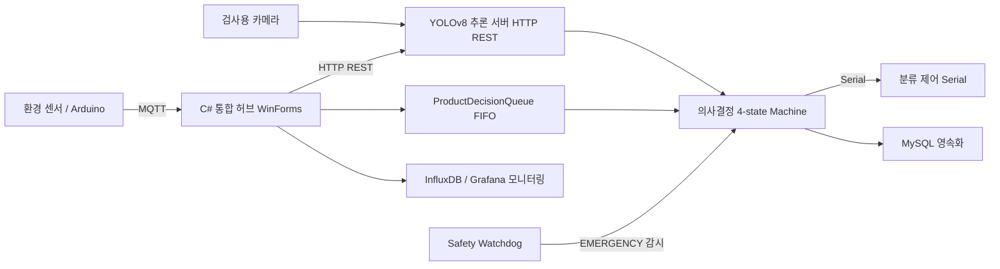
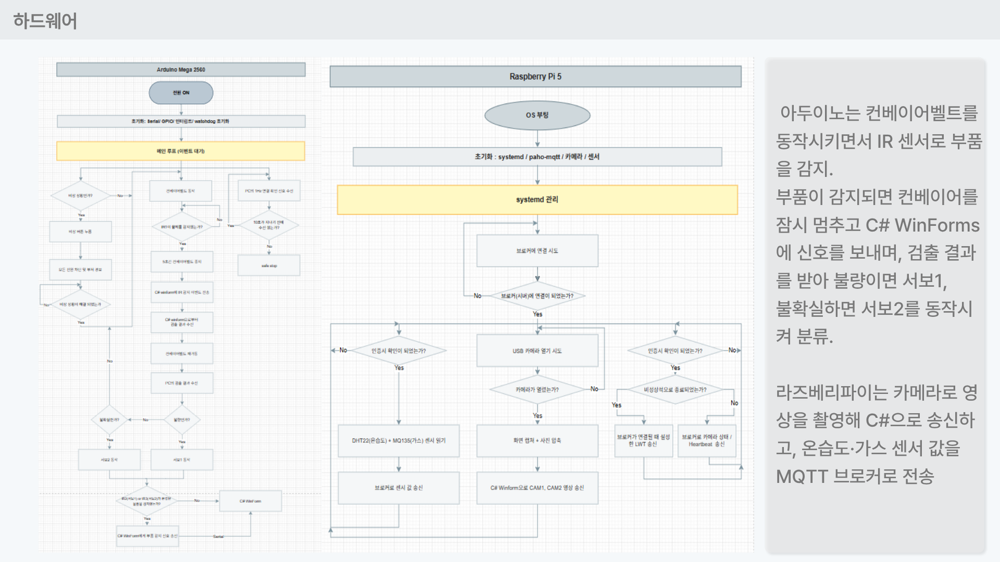
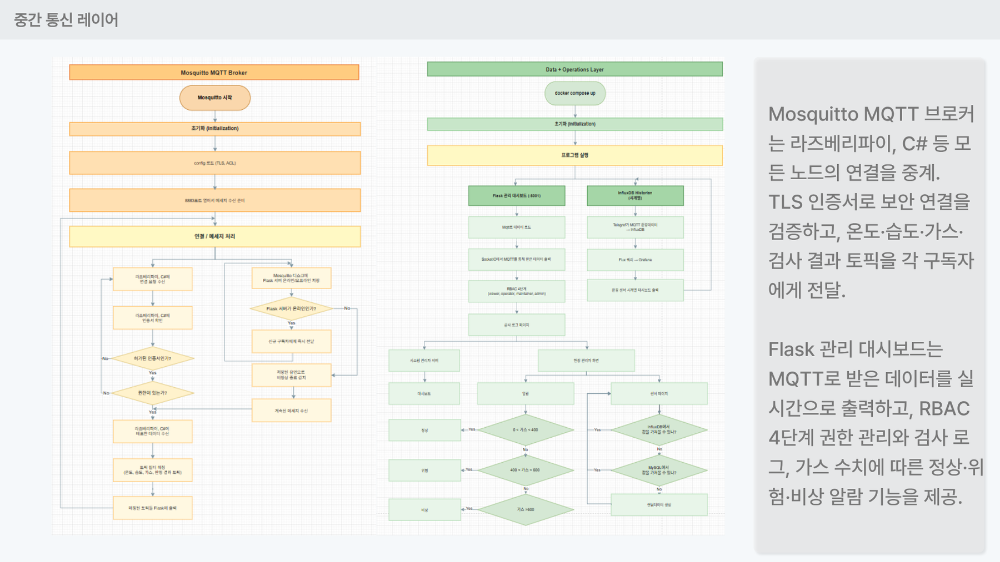
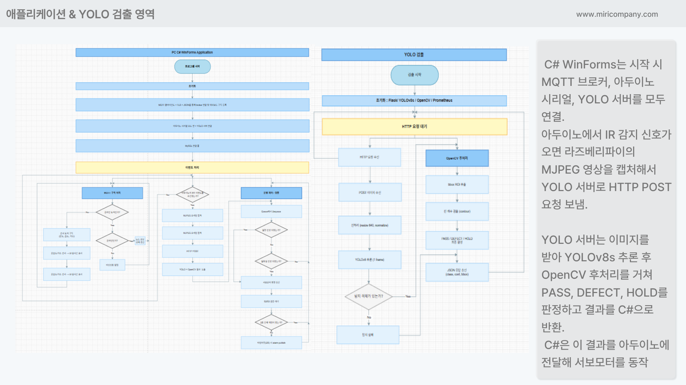

# 제조 데이터 관리 및 전송 시스템 (Manufacturing Data Hub)
> 환경 텔레메트리·실시간 제어·AI 추론·영속화를 단일 C# 허브로 통합한 제조 검사 라인 데이터 관리 시스템


## 📌 프로젝트 정보
| 항목 | 내용 |
|------|------|
| 개발 기간 | 2026.04.22 ~ 2026.05.03 |
| 팀 구성 | 5인 팀 프로젝트 (팀장 1 · 부팀장 1 · 팀원 3) |
| 담당 역할 | 부팀장 · Application Engineer (PC 통합 허브 및 의사결정 엔진) |
| 시연 영상 | 준비 중 |

## 🎯 프로젝트 개요
컨베이어 벨트 위 전자 부품을 AI 비전으로 자동 검사·분류하고, 모든 생산 데이터를 실시간으로 기록·관리하는 통합 제조 검사 시스템입니다. 부품을 YOLO + OpenCV로 검사해 **정상(PASS) / 불량(DEFECT) / 판정불가(HOLD)** 로 판단하고, 결과에 따라 서보 모터로 부품을 물리적으로 자동 분류합니다. 검사 결과·환경 데이터·이상 이벤트는 실시간 DB에 기록되고 대시보드로 모니터링됩니다.

본인은 **C# WinForms 통합 허브**를 담당하여, 데이터 특성에 따라 통신 프로토콜을 분리(MQTT / Serial / HTTP / MySQL)하고, 상태머신 기반 제어 흐름과 이중화 세이프티 감시를 적용해 라인의 안정성을 확보했습니다. 또한 ALCOA 원칙을 반영한 감사 로그와 관측성 엔드포인트를 통해 데이터 무결성과 모니터링을 동시에 충족하도록 설계했습니다.

> 목적: **검사 자동화**(사람 의존도 최소화) · **데이터 기반 품질 관리**(데이터 가시화) · **실시간 이상 대응**(안전한 자동화)

## ✨ 주요 기능 / 담당 업무
- **4채널 통신 허브 설계**: MQTT(환경 텔레메트리), USB Serial(실시간 제어), HTTP REST(YOLO 추론), MySQL(영속화)을 단일 C# WinForms 앱에 통합하고, 데이터 특성별로 프로토콜을 분리하는 원칙을 적용했습니다. C# 앱은 시작 시 MQTT 브로커·아두이노 시리얼·YOLO 서버를 모두 연결합니다.
- **ProductDecisionQueue (thread-safe FIFO)**: UI·MQTT·Serial·HTTP 4개 스레드가 동시에 접근하는 큐를 `ConcurrentQueue`로 설계하고, 컨베이어 위 동시 물체 수를 기준으로 큐 깊이 상한(10)을 두어 처리량 < 검사 속도 상황에서의 무한 메모리 증가를 차단했습니다.
- **4-state 의사결정 흐름**: 검사 지점과 분류 지점의 시간차를 FIFO 큐로 해결하고, 판정 결과(PASS / DEFECT / HOLD)에 따라 서보 모터 분류 명령을 내리는 제어 흐름을 설계했습니다.
- **Safety Monitor 이중화 감시**: MQTT 수신 신호를 감시하여 false 수신 시 즉시 EMERGENCY로 전이하고, 비상 정지 버튼 입력 시 모든 구동을 중단하도록 연계했습니다.
- **ALCOA 감사 로그 + 관측성**: 검사 결과·분류 결과·추적 로그를 MySQL에 손실 없이 저장하고, 큐 깊이 등 운영 지표를 Prometheus 메트릭으로 노출하여 Grafana 대시보드와 연계했습니다.

## 🛠 기술 스택
### Software
- C# .NET (WinForms, MQTTnet, OpenCvSharp, System.IO.Ports, MySql.Data)
- Python (Flask, Ultralytics YOLOv8, paho-mqtt)
- Arduino C++
- Mosquitto MQTT
- MySQL 8.0
- InfluxDB / Telegraf / Grafana
- Docker Compose
- Roboflow

### Hardware
- Raspberry Pi 5
- Arduino MEGA 2560
- 검사용 카메라 (CAM1 / CAM2, MJPEG 스트리밍)
- DHT22(온습도) · MQ135(가스) · MCP3008(ADC) · IR 센서 · 서보/DC 모터

## 🔀 시스템 아키텍처

센서와 Arduino의 데이터는 MQTT/Serial로 C# 허브에 수집되고, 카메라 영상은 YOLO 추론을 거쳐 4-state 의사결정 엔진으로 전달되며, 결과는 분류 제어·MySQL 영속화·Grafana 모니터링으로 분기되고 Safety Watchdog가 EMERGENCY 전이를 감시합니다.

전체 데이터 흐름은 다음과 같습니다. 아두이노가 IR 센서로 부품을 감지하면 컨베이어를 잠시 멈추고 C# WinForms에 신호를 보냅니다. C#은 라즈베리파이의 MJPEG 영상을 캡처해 YOLO 서버로 HTTP POST 요청을 보내고, YOLO 서버는 YOLOv8s 추론과 OpenCV 후처리를 거쳐 PASS / DEFECT / HOLD를 판정해 결과를 반환합니다. C#은 이 결과를 아두이노에 전달해 서보모터를 동작시켜 부품을 분류합니다.

## 💻 핵심 코드 (담당 역할)
> 아래 스니펫은 본인이 담당한 C# WinForms 통합 허브의 핵심 로직입니다. (발표 자료 코드 슬라이드 기준 발췌)

**1. ProductDecisionQueue — 4개 스레드가 동시 접근하는 thread-safe FIFO와 깊이 상한 제어**

UI·MQTT·Serial·HTTP 응답 스레드가 동시에 접근하므로 `ConcurrentQueue`를 선택했습니다. 컨베이어 위에 동시에 존재할 수 있는 물체 수를 기준으로 깊이 상한(10)을 두어, 분류가 검사를 못 따라가는 상황(처리량 < 검사 속도)에서 메모리가 무한 증가하는 것을 막고 초과 시 새 물체를 거부합니다. 큐 깊이는 메트릭으로 노출해 Grafana에서 시각화합니다.

```csharp
private readonly ConcurrentQueue<ProductDecision> _queue = new();
private readonly object _statsLock = new();
private const int MaxDepth = 10;

public bool Enqueue(ProductDecision decision)
{
    if (_queue.Count > MaxDepth)
    {
        // 분류가 검사를 못 따라가는 상황 → 새 물체 거부
        Log.Warning("ProductDecisionQueue overflow! Depth={Depth}", _queue.Count);
        return false;
    }

    _queue.Enqueue(decision);
    AppMetrics.QueueDepth.Set(_queue.Count); // Prometheus → Grafana
    return true;
}
```

**2. MQTT 연결 옵션 — LWT(Last Will) + Persistent Session으로 무손실 수신**

C# 메인 Form이 일정 시간 신호를 보내지 않으면 브로커가 연결을 죽은 것으로 간주하고 LWT(유언장)를 발행하도록 설정했습니다. 또한 `CleanSession(false)`로 영속 세션을 유지해, 잠깐 끊겼다 재연결할 때 브로커가 그동안 누락된 메시지를 다시 보내주어 RPi가 publish한 환경 데이터의 손실이 없도록 했습니다.

```csharp
var builder = new MqttClientOptionsBuilder()
    .WithClientId(_cfg.ClientId)
    .WithTcpServer(_cfg.BrokerHost, _cfg.BrokerPort)
    .WithKeepAlivePeriod(TimeSpan.FromSeconds(30))
    .WithCleanSession(false); // 영속 세션 → 재연결 시 누락 메시지 재수신

if (!string.IsNullOrEmpty(_cfg.Username))
    builder = builder.WithCredentials(_cfg.Username, _cfg.Password);

// 비정상 종료 시 브로커가 대신 발행하는 유언장(LWT)
builder = builder
    .WithWillTopic(_cfg.WillTopic)
    .WithWillPayload(lwtPayload) // { "status": "offline", ... }
    .WithWillQualityOfServiceLevel(MqttQualityOfServiceLevel.AtLeastOnce)
    .WithWillRetain(true);
```

## 🔧 기술적 도전과 해결 (Technical Challenges)

### Q1. 세 개의 시리얼을 동시에 연결하니 하나가 지연될 때 전체 UI가 멈췄다
> **Challenge:** C# 허브가 여러 통신 채널을 동기적으로 처리하다 보니, 하나의 연결이 응답 지연되면 UI 스레드가 블로킹되어 전체 화면이 멈추는 현상이 발생했습니다.
> **Solution:** 각 연결을 비동기 처리로 분리해 UI 스레드가 블로킹되지 않도록 했습니다. 통신 수신과 화면 갱신을 분리하여, 한 채널의 지연이 전체 응답성에 영향을 주지 않게 만들었습니다.

### Q2. MQTT 센서 데이터가 실시간으로 계속 들어와 DB 저장과 대시보드 출력이 동시에 경합했다
> **Challenge:** MQTT로 수신되는 센서 데이터가 끊임없이 들어오는 상황에서 DB 저장과 대시보드 출력이 동시에 처리되어, 수신 처리량을 따라가지 못하는 문제가 있었습니다.
> **Solution:** MQTT 수신과 DB 저장을 분리했습니다. 수신은 메모리 큐에 먼저 쌓고, 별도 스레드에서 배치(batch)로 저장하는 방식으로 바꿔 수신 경로의 부하를 낮췄습니다. 동일한 원리로 의사결정 큐도 깊이 상한을 둔 thread-safe FIFO로 설계했습니다.

### Q3. 잠깐 끊겼다 재연결되는 동안 RPi가 보낸 환경 데이터가 손실됐다
> **Challenge:** C# 메인 Form이 잠깐 끊겨 있는 동안 RPi가 환경 데이터를 계속 publish하면, 그 사이의 메시지가 유실될 위험이 있었습니다.
> **Solution:** 브로커에 영속 세션(`CleanSession=false`)을 적용하고, 비정상 종료를 감지하는 LWT를 설정했습니다. 재연결 시 브로커가 누락 메시지를 다시 전달해 데이터 손실이 없도록 하고, 끊김 자체는 LWT로 즉시 인지할 수 있게 했습니다.

## 📸 스크린샷
> 발표 자료(PPT) 화면을 `images/` 폴더에 추가한 뒤 아래 경로를 맞춰주세요.

| 화면 | 설명 |
|------|------|
|  | C# WinForms 통합 허브 메인 대시보드 (제어 패널·센서 스트립·생산 통계·Serial 모니터) |
|  | C# WinForm 측 통합 허브 구성도 — MQTT / USB Serial / HTTP Client / MySQL Writer 4채널 |
|  | ProductDecisionQueue 핵심 코드 (ConcurrentQueue + 깊이 상한 제어) |
|  | Grafana 환경 텔레메트리 모니터링 (온도·습도·가스 그래프) |

## 🎬 시연 영상
[](여기에-유튜브-링크)
> 시연 영상은 준비 중입니다.
